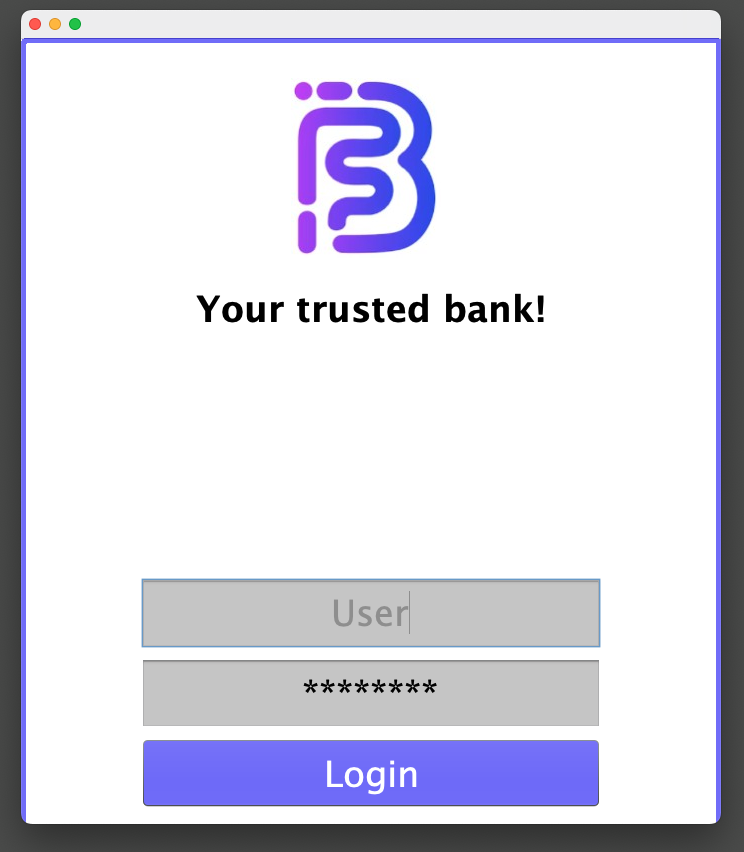
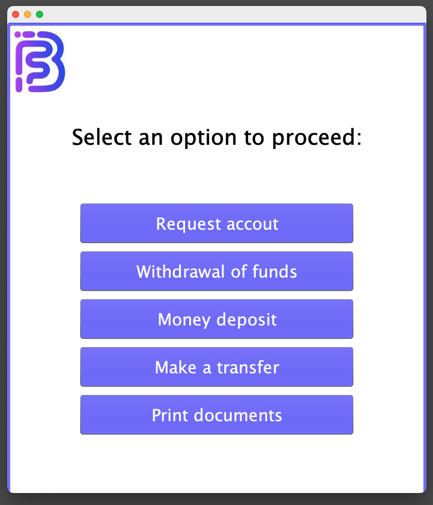
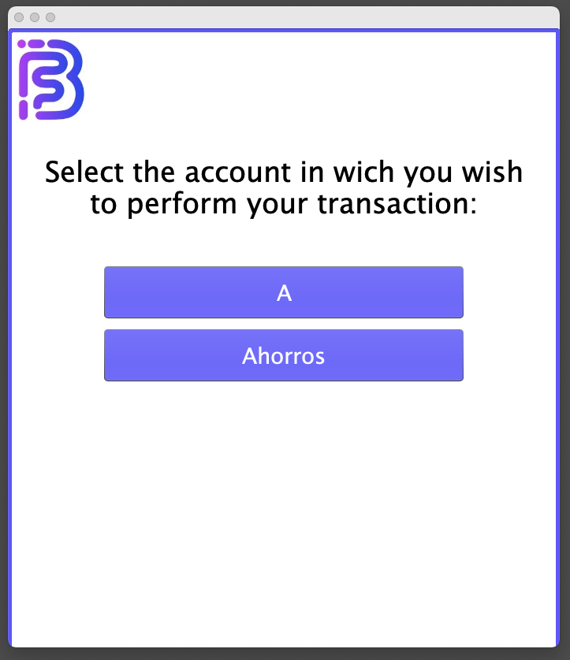
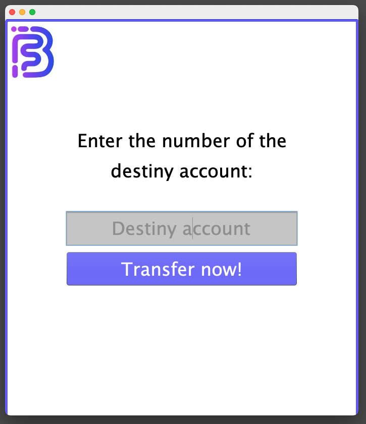
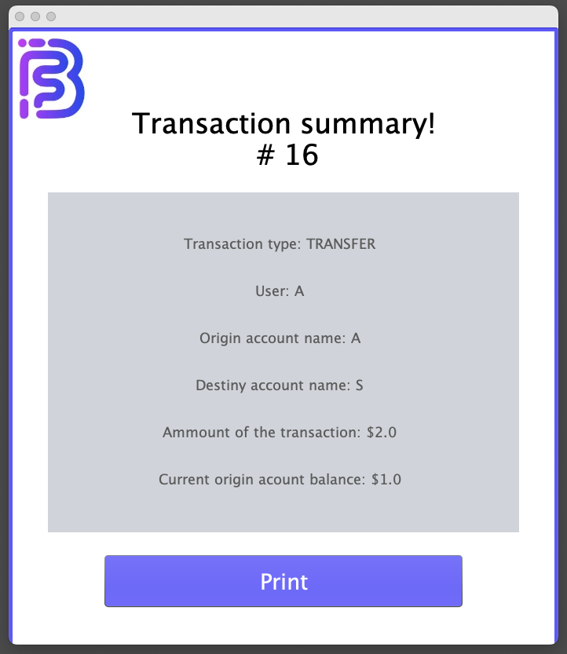

# ATM Application

## Table of Contents
- [General Info](#general-info)
- [Technologies Used](#technologies-used)
- [Features](#features)
- [Screenshots](#screenshots)
- [Room for Improvement](#room-for-improvement)

## General Info
The ATM Application is a university project developed in Java, featuring a simple user interface built with the Swing library. It allows users to perform basic banking operations such as logging in, opening accounts, making deposits, withdrawing funds, and transferring money between accounts.

As part of the project constraints, text files were used as data repositories. Accounts and transactions are stored in these files, and objects are reconstructed using basic string manipulation techniques.

The application's logic ensures fundamental checks, such as verifying sufficient account balance before transactions, but remains non-robust due to project limitations. Auto-incremental IDs are simulated via a dedicated file storing ID counters.

[Back to top](#table-of-contents)

## Technologies Used
- **Java**: Core programming language for logic and backend.
- **Swing Library**: Used for building the graphical user interface.

[Back to top](#table-of-contents)

## Features
- User authentication via a simple login screen.
- Open new accounts with unique IDs generated automatically.
- Perform deposits, withdrawals, and money transfers.
- Maintain account and transaction records in plain text files.
- Enum-based transaction logic for different operation types.

[Back to top](#table-of-contents)

## Screenshots

[Back to top](#table-of-contents)

## Room for Improvement
- **Database Integration**: Replace plain text files with a database for better data management.
- **Data Normalization**: Design and normalize table relationships for improved efficiency.
- **Enhanced Validation**: Add robust checks for transfer and withdrawal operations.
- **Scalability**: Redesign the system to handle a larger number of users and transactions.
- **User Interface**: Improve the UI for better usability and visual appeal.

[Back to top](#table-of-contents)
